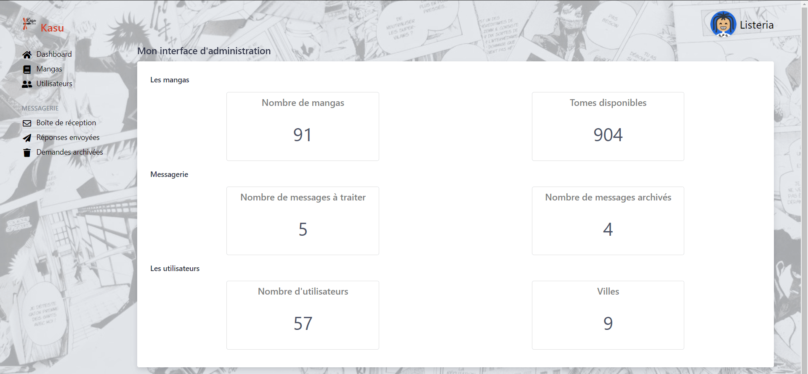

# Kasu - projet de fin d'études
  

## Description
Ceci est un projet de fin d'études dans le cadre d'une formation intensive de Développeur Web Fullstack.
Nous étions 5 étudiants sur ce projet de l'idée au déploiement.

**Ce repository concerne exclusivement la partie front-end de l'application.**

Le front est hébergé sur surge : [KASU](https://kasu.surge.sh)

Le back-office est hébergé sur O2Switch : [BACK-OFFICE](https://admin.kasu.laetitia-dev.com)

## MVP

Il s'agit d'un projet de prêt de mangas entre particuliers, avec différentes fonctionalités :

- Possibilité de s'inscrire ou se connecter, de modifier son profil utilisateur et sa collection de mangas (les mangas et les tomes associés)
- Possibilité de faire une recherche par code postal, sur un rayon de 30kms et de voir les mangas et tomes disponibles
- Possibilité de contacter un utilisateur via un système de chat en realtime
- Possibilité de modifier la disponibilité de ses tomes selon les prêts validés
- Possibilité de contacter un admin via un formulaire de contact

## Stack
- **Front-end** : React/Redux,
- **Back-end** : Symfony5, MySQL

La communication fonctionne donc en mode API, avec sécurisation par token JWT. 

### Dépendances front-end principales:

- redux-persist pour la persistence du state en localstorage
- Utilisation de semantic-ui-react comme framework css (intégration react) + complété par du CSS natif
- react-router-dom assure le routing en front
- react-uuid pour créer des keys uniques pour les composants React issus de fonctions itératives type .map
- react-responsive pour les cas où les media queries css ne suffisaient pas
- react-multi-carousel : carouel de page d'accueil
- prop-types : vérificateur de props React.
- axios : pour nos requêtes HTTP (au lieu de l'api fetch)

**Chat en realtime :**
- via un serveur Node et socket.io.

## V2
Dans une V2, nous envisageons de :
- Pouvoir adapter le rayon de recherche selon la saisie utilisateur
- Pouvoir faire une recherche par manga
- Pouvoir gérer les transactions, et automatiquement gérer la disponibilité des tomes selon la transaction et sa durée
- Pouvoir visualiser les rendez-vous passés et à venir
- Pouvoir charger une photo de profil

## Screenshots

### Front-end

### Back-end

